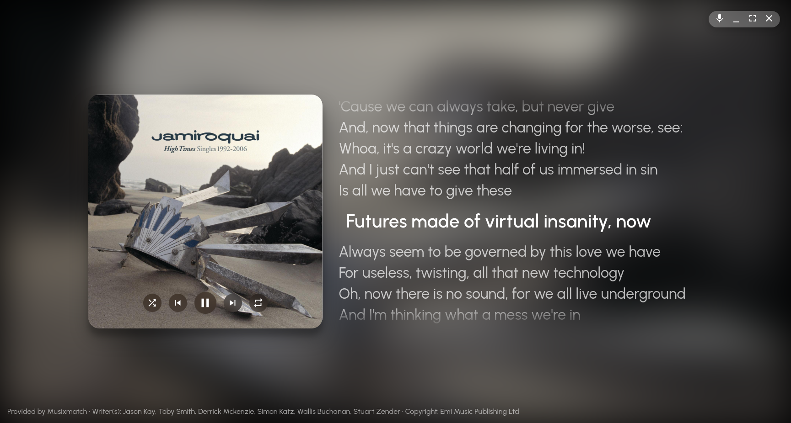

# Sunamu (スナム)
Show your currently playing song in a stylish way!

## OwO wats dis?

Sunamu (pronounced as it is written) is a fancy music controller whose only purpose is to look as fancy as possible on secondary displays.

It only supports Linux for now. macOS and Windows support are not planned.

## Features

- Display what you are playing in your TV, secondary display, or (heck) around the entire house!
- Get lyrics for your songs!
- Bragging rights for your particular taste in music!*

  *No responsibility is taken from the Sunamu devs and contributors if you have bad taste in music

## Installation

Get the latest release from the [Releases](https://github.com/AryToNeX/Sunamu/releases/latest) section. The AppImage is recommended since it runs basically everywhere.

## Usage

Just launch it and preferably put it in fullscreen!

## How-to: Lyrics from Musixmatch

You'd have to install the official Musixmatch Desktop App on your computer. Then launch it once; login is not really required. Sunamu will automatically configure itself based on your Musixmatch Desktop installation.

## Observed quirks

- Spotify (official app): Their MPRIS2 implementation sucks; as such, you lose synchronized lyrics, the seekbar and the ability to seek to specific parts of a song.
- Spotify-qt: The album tag is always `[object Object]`: This can be worked around on our end, but it is nonstandard MPRIS2 implementation and the dev of that project should just follow the spec.

## License

See the LICENSE file.
