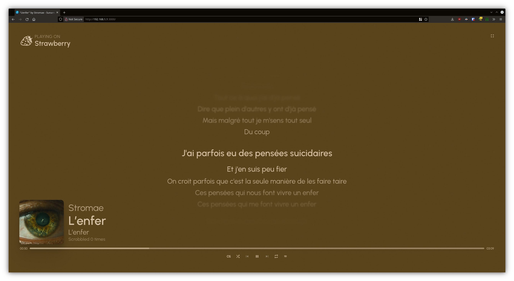
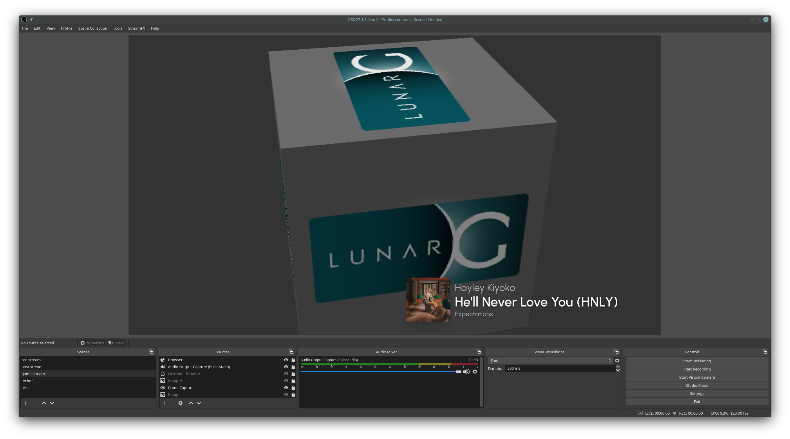
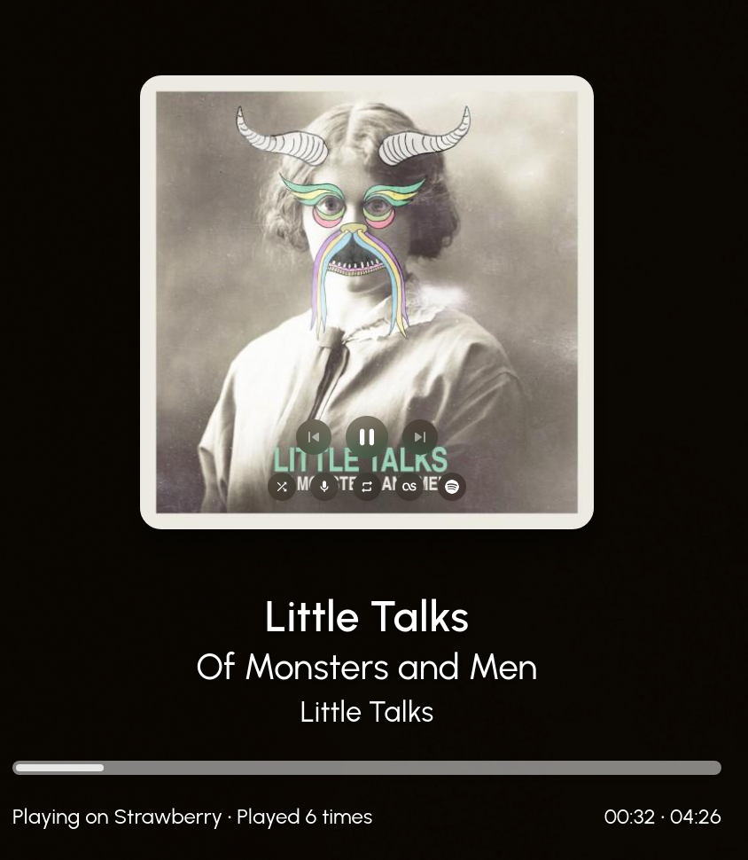

# Sunamu (スナム)
Show your currently playing song in a stylish way!

## OwO wats dis?

Sunamu (pronounced as it is written) is a fancy music controller whose only purpose is to look as fancy as possible on secondary displays.

_It effectively is the WAY TOO COMPLEX successor of MPRISLyrics, a project I made back when synchronized lyrics on Linux was a niche thing to have._

It only supports Windows and Linux for now. macOS support is not planned. Pull request, someone?

## Features

- Display what you are playing in your TV, secondary display, or (heck) around the entire house!
- Get the Spotify link for every song you listen to!*
- Get lyrics for your songs!
- Get a _GOOD_ Discord Rich Presence, finally!*
- Bragging rights for your particular taste in music!**

  *This feature, or part of it, requires a Spotify Client ID and Client Secret.

  **No responsibility is taken from the Sunamu devs and contributors if you have bad taste in music

## Installation

### Windows / Linux

Get the latest release from the [Releases](https://github.com/NyaomiDEV/Sunamu/releases/latest) section.

On Windows, you can choose between the installer and the ZIP file (portable app).

On Linux, the AppImage is recommended since it runs basically everywhere (but also Flatpak, Fedora/RedHat, Debian and Arch packages are provided.)

### Arch Linux

`sunamu` and `sunamu-git` are available as AUR packages. Install either of them via your AUR helper of choice.

## Configuration

Sunamu's configuration file is located in:
- Linux: Usually `~/.config/sunamu/config.json5` (`$XDG_CONFIG_HOME/sunamu/config.json5`);
- Linux Flatpak: `~/.var/app/xyz.nyaomi.sunamu/config/sunamu/config.json5`;
- Windows: `%APPDATA%\sunamu\config.json5`.

You can use it to enable or disable features, and there are a LOT of them!

Do you want to give it a read? [Here it is!](assets/config.json5)

## Usage

Just launch it and preferably put it in fullscreen!

## Notable observed quirks

Check and contribute to the compatibility table [here](COMPATIBILITY.md).

## License

See the [LICENSE](LICENSE) file.
